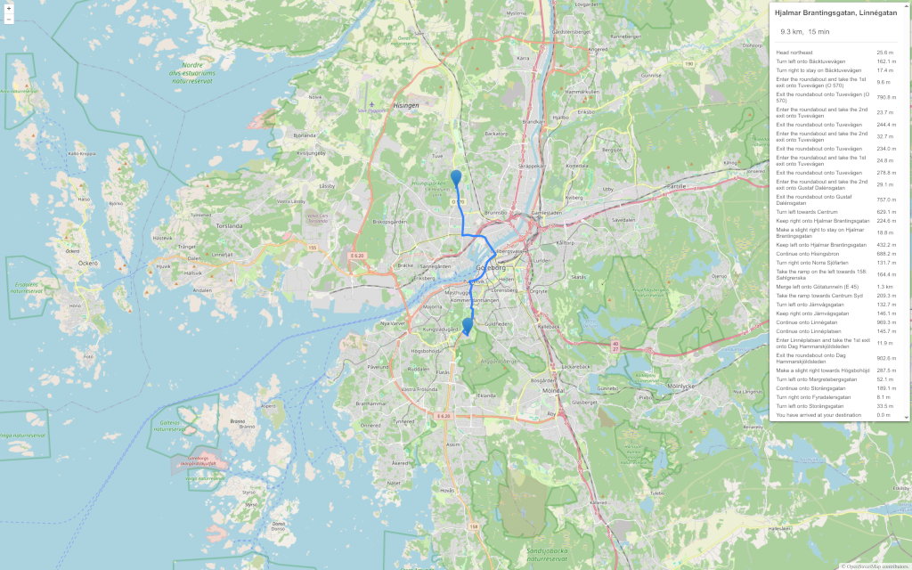

**OSRM Routing plugin for OpenLayers >=8.0.0**

Routing with OSRM
=================
This plugin is available for OpenLayers version >=8.0.0 and is under active development.
Plugin source code is available at https://github.com/strues-maps/ol-osrm .
This plugin is licensed under ISC.

This plugin was developed by porting relevant parts from openlayers-routing-machine for
OpenLayers4 by Per Liedman. OpenLayers4 plugin was available at https://github.com/perliedman/openlayers-routing-machine .

Building plugin locally
=======================
- `$ npm install # install dependancies`
- `$ npx eslint src # lint the codebase`
- `$ npm run build # build distribution folder`

Plugin configuration
====================

olrm.Control(options)
---------------------

| Option                           | Description               | Optional |
|----------------------------------|---------------------------|----------|
| map                              | OpenLayers map            | Required |
| waypoints                        | [[x1, y1], [x2, y2], ...] | Optional |
| geocoder                         | Object                    | Optional |
| waypointsListener                | function(event) { }       | Optional |
| routesListener                   | function(event) { }       | Optional |
| router                           | new olrm.OSRMv1() {}      | Optional |
| suppressDemoServerWarning        | boolean                   | Optional |
| serviceUrl                       | string                    | Optional |
| profile                          | string                    | Optional |
| timeout                          | integer                   | Optional |
| routingOptions.alternatives      | boolean                   | Optional |
| routingOptions.steps             | boolean                   | Optional |
| routingOptions.polylinePrecision | integer                   | Optional |
| routingOptions.useHints          | boolean                   | Optional |
| routingOptions.language          | string                    | Optional |
| routingOptions.requestParameters | string                    | Optional |

olrm.OSRMv1(options)
--------------------

| Option                           | Description               | Optional |
|----------------------------------|---------------------------|----------|
| suppressDemoServerWarning        | boolean                   | Optional |
| serviceUrl                       | string                    | Optional |
| profile                          | string                    | Optional |
| timeout                          | integer                   | Optional |
| routingOptions.alternatives      | boolean                   | Optional |
| routingOptions.steps             | boolean                   | Optional |
| routingOptions.polylinePrecision | integer                   | Optional |
| routingOptions.useHints          | boolean                   | Optional |
| routingOptions.language          | string                    | Optional |
| routingOptions.requestParameters | string                    | Optional |

Plugin usage
============
Plugin examples are available at `./examples` folder. `index.html` includes
files from `./dist` folder that is generated using `npm run build` command. 

Found a bug?
===================================
If you found a bug, feel free to report it at https://github.com/strues-maps/openlayers-osrm/issues

